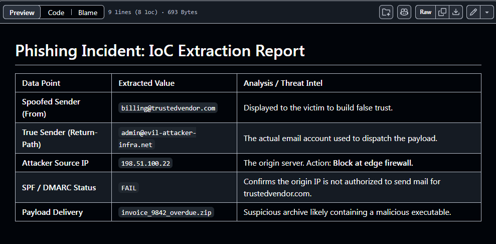

### Summary
Conducted Tier 1 SOC analysis on a simulated Business Email Compromise (BEC) and malicious payload delivery attempt by extracting Indicators of Compromise (IoCs) from raw email headers.

### Environment
* **Platform:** GitHub
* **Concepts:** Security Operations Center (SOC) Analysis, Phishing Investigation, Email Header Parsing, SPF/DKIM/DMARC Authentication, Threat Intelligence, IoC Extraction.

### Diagnostic / Execution Steps
1. Analyzed a suspicious email reported by an end-user, containing a potentially malicious ZIP archive payload.
2. Investigated the raw SMTP email headers to bypass the spoofed `From` address (`billing@trustedvendor.com`).
3. Extracted the true origin of the attack via the `Return-Path` and `Received` IP address.
4. Verified that the sending IP failed SPF and DMARC checks, confirming unauthorized sender spoofing.
5. Compiled an actionable IoC report for the firewall and endpoint security teams to block the attacker's infrastructure.

### Evidence

### Lessons Learned
Attackers frequently utilize display name spoofing to bypass human suspicion. Security analysts must rely on verifiable protocol checks (SPF/DMARC) and raw header data to accurately trace and block threat actor infrastructure.
